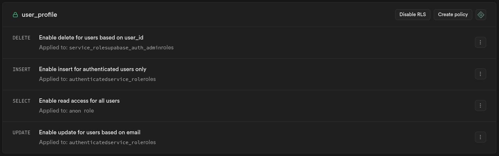
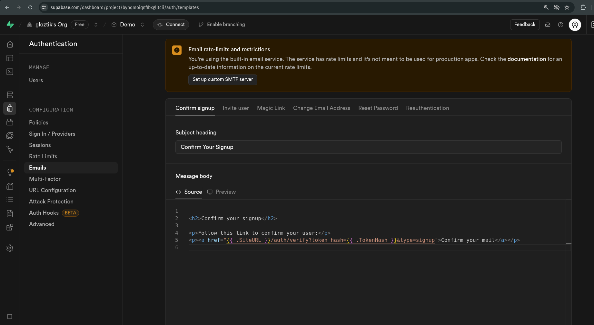
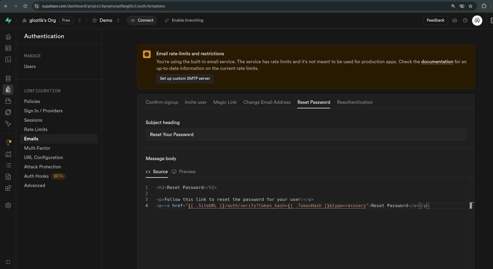

# 🔐 Supabase + Next.js Authentication Template

A ready-to-use authentication template built with **Supabase Auth** and **Next.js App Router**. Designed for quick project kickstarts—just clone the repo, update the Supabase credentials, and you're ready to go!

This template includes:

- ✅ Email/password sign up & login
- 🔁 Forgot/reset password functionality
- 📩 Email verification handling via Supabase
- 🔄 Redirect pages for confirm/reset actions
- 🧰 Clean, reusable authentication components using **ShadCN UI**
- ⚡ Built with Next.js App Router
- Future Updates - Login with Social Media
 
---

## 🚀 Getting Started

### 1. Clone the Repository

```bash
git clone https://github.com/ameghcoder/auth-using-supabase-nextjs.git
cd your-repo-name
```

### 2. Install Dependencies

```bash
npm install
# or
yarn
```

### 3. Create a Supabase Project

1. Go to [https://supabase.com](https://supabase.com)
2. Click **"New Project"**
3. Set up your database (choose region, password, etc.)
4. Once created, go to **Settings → API**

Copy the following values:

- `SUPABASE_URL`
- `SUPABASE_ANON_KEY`
- `SUPABASE_SERVICE_ROLE_KEY`

### 4. Configure Environment Variables

Create a `.env.local` file in the root of your project and add:

```env.local
NEXT_PUBLIC_SUPABASE_URL=your_supabase_url
NEXT_PUBLIC_SUPABASE_ANON_KEY=your_supabase_anon_key
SUPABASE_SERVICE_ROLE_KEY=your_supabase_service_role_key

```

### 5. Run the Development Server

```bash
npm run dev
```

---

### 6. Remember to do this

### (i). *Create a single table called "user_profile" for making your authentication production ready. For using this template you also need to create a table "user_profile" where you need to add three columns necessary, (you can add more but these three are necessary to create)*

- id
- email
- is_verified

Here is the SQL code to create the table in public schema -

```sql
create table public.user_profile (
  id uuid not null default auth.uid (),
  email text not null,
  is_verified boolean null default false,
  created_at timestamp with time zone not null default now(),
  updated_at timestamp with time zone null,
  constraint user_profile_pkey primary key (id),
  constraint user_profile_email_key unique (email),
  constraint user_profile_id_fkey foreign KEY (id) references auth.users (id)
) TABLESPACE pg_default;
```

After that you need to enable the RLS policy and add policies for CRUD operation.
Here is the screenshot of all policies that you need to create with the Target Roles.



You can modify the roles for each policy based on your use.

### (ii). *Last and final step before using the Authentication, you need to change the email template to support a server-side authentication flow.*

For doing so, Go to the Auth templates page in your dashboard. In the Confirm signup template, change <span style="color:lime;">*{{ .ConfirmationURL }} to {{ .SiteURL }}/auth/verify?token_hash={{ .TokenHash }}&type=signup*</span> here is the path to find this template code

First go to your project > click on authentication > then click on Emails.

Here you will find out many email templates, but you only need to focus on **Confirm signup** and **Reset Password**, change their url as shown in the following image.

## For Confirm Signup Template*

- Change this *{{ .ConfirmationURL }}* to this *{{ .SiteURL }}/auth/verify?token_hash={{ .TokenHash }}&type=signup*


## For Reset Password Template

- Change this *{{ .ConfirmationURL }}* to this *{{ .SiteURL }}/auth/verify?token_hash={{ .TokenHash }}&type=recovery*


> Note: Above task is necessary otherwise your verification email link and reset password link is not working properly

Now here your Authentication setup for Next.js using Supabase is completed now you can run this project and

- Go to [http://localhost:3000/auth/signup](http://localhost:3000/auth/signup) page for register a new user
- Go to [http://localhost:3000/auth/login](http://localhost:3000/auth/login) page for login with new user
- Also you can reset your password if you forgot simply click on the Forgot Password link in login page, then enter your email and get a password reset verification link and after click on the link you will redirected to the localhost:3000/auth/verify page and able to set new password.

> Note: You can signup and verify your email in different browsers.

---

## 📁 Features Overview

### 🔐 Authentication Pages

- `/auth/login` – Login with email and password
- `/auth/signup` – Create a new account
- `/auth/login` - Contains a button for forgot-password that opens a pop us to reset password
- `/auth/login` & `/auth/signup` - Contains a button for Resend Confirmation link, if someone miss of forgot to verify email, that opens a pop us to send verification email

### 📩 Supabase Redirect Pages

- `/auth/verify` – Handles email confirmation from Supabase and detect the redirection type if,
- type 'signup' - then shows a email confirmation popup
- type 'recovery' - then shows a Set New Password dialog

These routes automatically capture Supabase redirect parameters and handle the logic for you.

---

## 📦 Built With

- [Next.js 15+ (App Router)](https://nextjs.org/docs/app)
- [Supabase](https://supabase.com)
- [ShadCN UI Components](https://ui.shadcn.com)
- [Tailwind CSS](https://tailwindcss.com/)

---

## 🔧 Future Usage

Use this repo as a starting point for any new project that requires authentication. It handles the full email auth lifecycle so you can focus on building your core app logic.

To start a new project:

1. Clone this repo
2. Replace Supabase credentials
3. Rename the project directory
4. Start coding 🚀

## Future Update

I will also include some other method for login like Google, LinkedIn and other social media also. Or you can also contribute in this repo. Star this repo if you find it helpful.

---

## 📄 License

This project is licensed under the MIT License – feel free to use it for personal or commercial projects.
See the [LICENSE](./LICENSE.txt) file for details.

---

## 🧑‍💻 Author

Built by [Yashraj](https://github.com/ameghcoder)  
My [LinkedIn Profile](https://linkedin.com/in/yrjdeveloper)
Feel free to connect and contribute!
